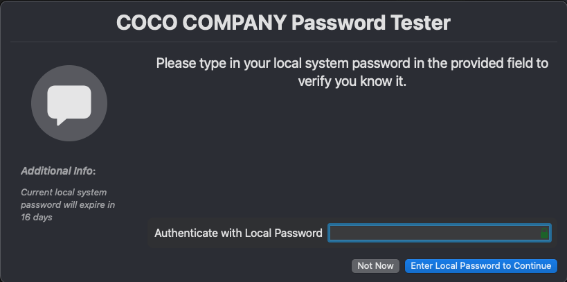
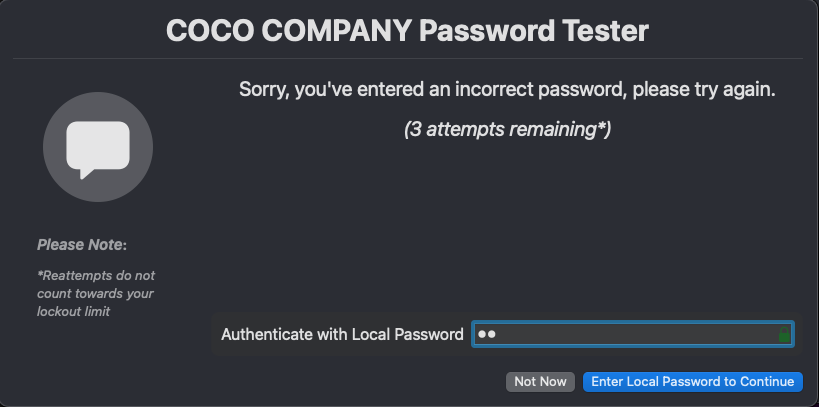
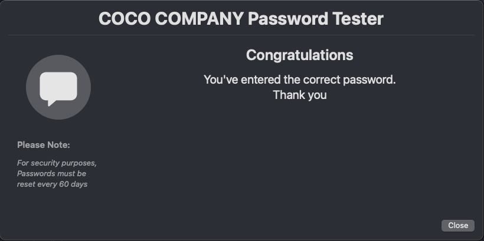

# Password test window via swiftDialog

Leverages `switftDialog` and Jamf Pro Scripts to easily display engaging end-user messages to test the local admin password.
Some enviroments that require full SmartCard enforcement have no way of remind the users to test/remember the local password, this gives the user an easy prompt to test the password, while not using up the FailedLoginCount limit.

Initial Window

Failed Window

Sucess Window

## Requirements
swiftDialog [link…](https://github.com/swiftDialog/swiftDialog)
MDM Deployment [Jamf Pro]
